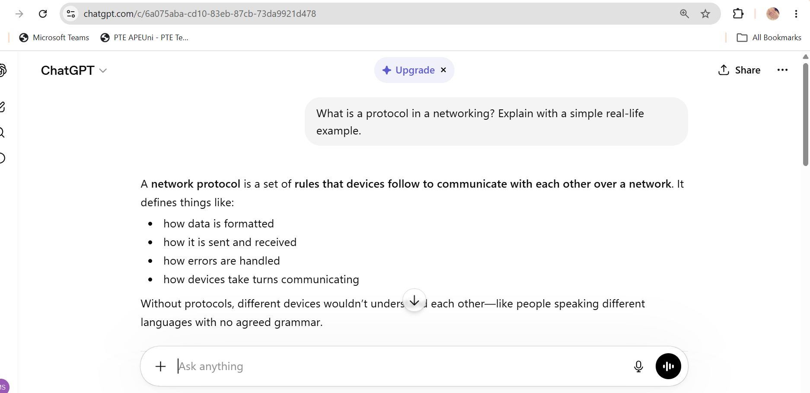
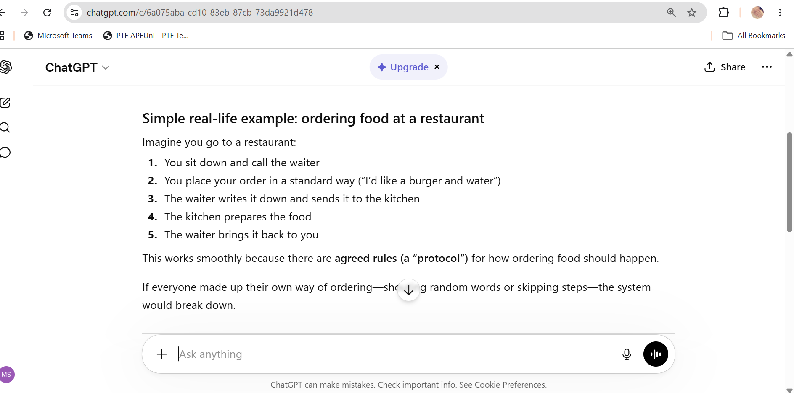
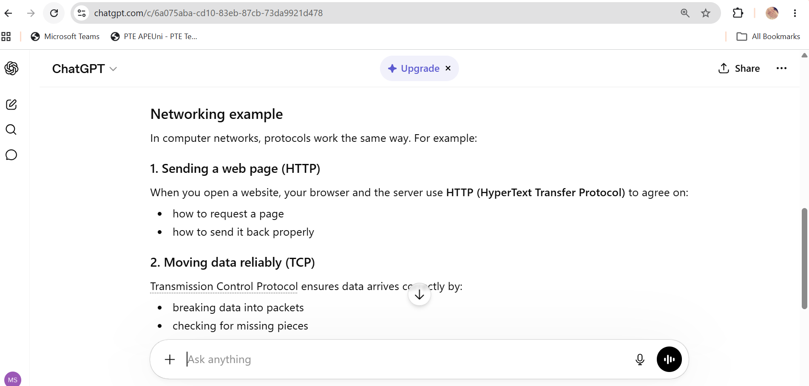
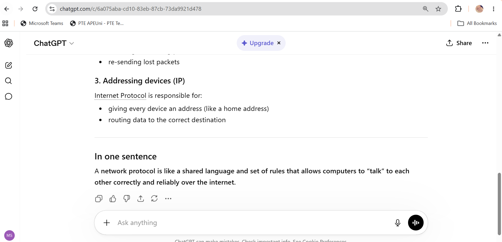
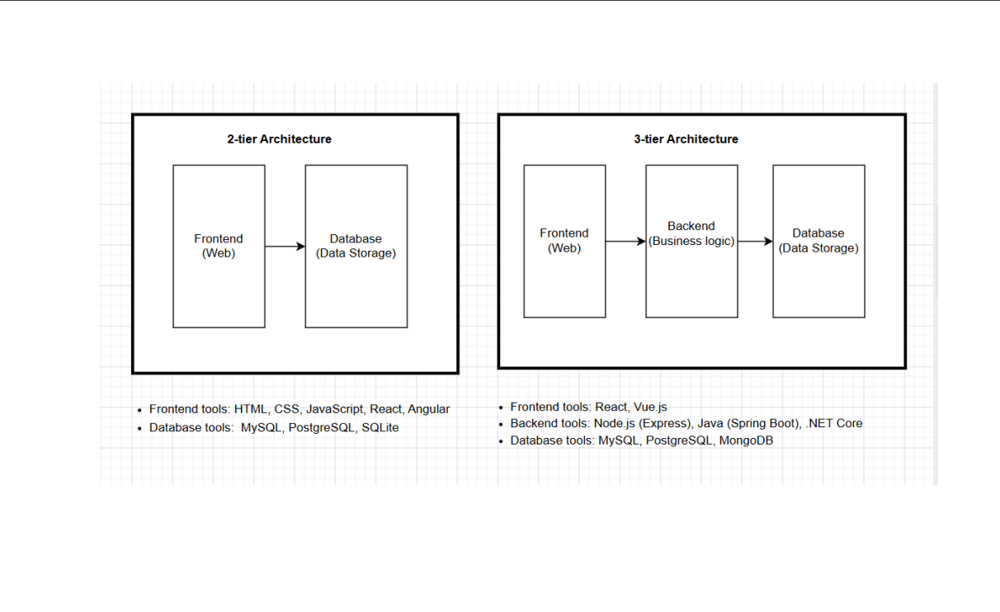
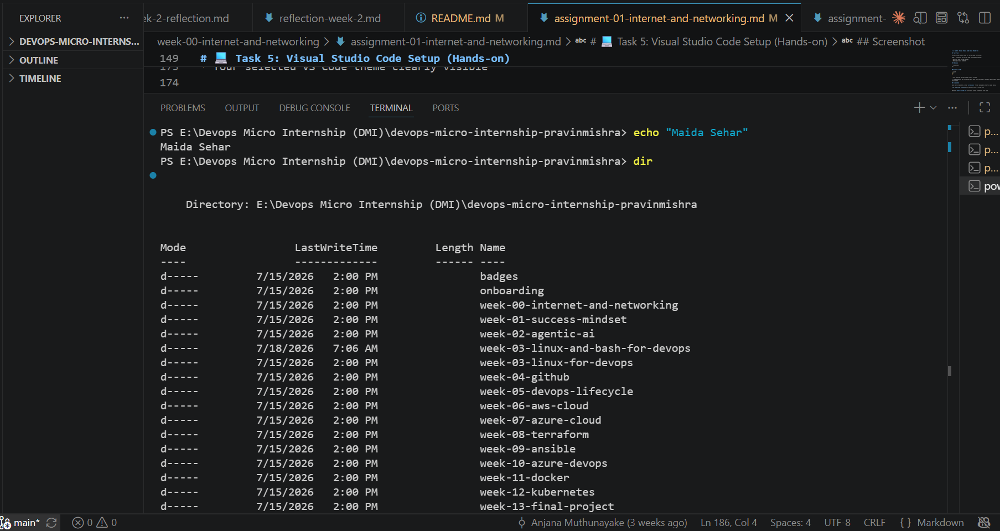

# Week 00 - Internet and Networking

Part of the DevOps Micro Internship (DMI) Cohort 3 with Agentic AI

---

# 🧑‍💻 Task 1: Using ChatGPT as Your Learning Assistant

## Scenario

You're new to DevOps and will frequently encounter technical questions. ChatGPT can be your learning companion.

## Your Task

Write a clear ChatGPT prompt to help you understand:

> "What is a protocol in networking? Explain with a simple real-life example."

Take a screenshot of your interaction showing:

* Your detailed prompt (with clear expectations)
* ChatGPT's simplified response with an example

## Screenshot







---

## What I Learned (2–3 lines)

Working with ChatGPT as a learning assistant showed me how useful it is for breaking down technical concepts into simple relatable analogies like comparing networking protocols to a phone conversation. I learned that a good prompt (specific and clear about what I want) makes a huge difference in getting a genuinely useful easy-to-understand explanation rather than an overly technical one.

---

# 🌐 Task 2: Internet and Networking

## Scenario

Your friend is launching an online bookstore named **EpicReads**.

He asked you to explain how users globally can access his website hosted in Finland.

## Your Task

Write a short explanation (**100–150 words**) that includes:

* Packet Switching
* IP Address
* TCP/IP
* HTTP/HTTPS

💡 **Tip:** You may use ChatGPT (as demonstrated in Task 1) to refine your explanation.

## Answer

When someone visits EpicReads.com from anywhere in the world, their browser breaks the request into small pieces called packets a process called packet switching allowing data to travel efficiently across different network paths. Each device including the Finland-based server has a unique IP address acting like a postal address so packets reach the right destination. The TCP/IP protocol suite governs this journey: IP handles addressing and routing while TCP ensures packets arrive complete and in order re-sending anything lost. Finally, HTTP/HTTPS defines the "language" the browser and server use to request and deliver the webpage, with HTTPS adding encryption for security. Together these layers let a user anywhere reliably load a website hosted in Finland within seconds.

---

# 🏗️ Task 3: Application Architecture & Stack

## Scenario

EpicReads bookstore has two application versions:

### Two-Tier Application

* Frontend
* Database

### Three-Tier Application

* Frontend
* Backend
* Database

## Your Task

* Draw simple diagrams (hand-drawn or tool-based such as draw.io)
* Label each layer clearly
* List at least two common technologies or tools used for each layer
* Submit a screenshot or photo clearly showing your own drawing

## Diagram Screenshot / Photo




---

## Technologies Used

### Frontend

* HTML, CSS, JavaScript
* React, Angular

### Backend

* Node.js (Express)
* Java (Spring Boot), .NET Core

### Database

* MySQL, PostgreSQL
* SQLite, MongoDB

---

# 🌍 Task 4: Domain Name & DNS (Basic Concepts)

## Scenario

Your friend's bookstore **EpicReads** is currently accessible through:

```text
52.172.142.222:3000
```

He purchased the domain:

```text
epicreads.com
```

## Your Task

In **50–100 words**, explain in your own words:

1. What is DNS (Domain Name System)?
2. Which DNS record type should be used to connect the domain to the given IP, and why?

## Answer

DNS (Domain Name System) is essentially the internet's phonebook it translates human-friendly domain names like epicreads.com into the numeric IP addresses computers actually use to locate each other. Without DNS users would need to memorize IP addresses instead of simple domain names. To connect epicreads.com to the IP 52.172.142.222, an A record should be used since A records map a domain directly to an IPv4 address. This allows anyone typing epicreads.com into their browser to be automatically routed to the correct server regardless of the underlying numeric address.

---

# 💻 Task 5: Visual Studio Code Setup (Hands-on)

## Your Task

Install Visual Studio Code (if not already installed).

Take a screenshot of your VS Code environment showing:

* Terminal open inside VS Code
* Running a basic command:

### Windows

```powershell
dir
```

### Linux / macOS

```bash
pwd
ls
```

* Your selected VS Code theme clearly visible

⚠️ **Important:** The screenshot must show your username or another identifiable detail to confirm it is your environment.

## Screenshot




---

# 🔗 Task 6: Publish Your Assignment as a LinkedIn Post

## Objective

Publishing on LinkedIn helps you:

* Build your professional online presence
* Reinforce your learning
* Document your DevOps journey publicly

## Your Task

Summarize your answers from Tasks 1–5 into a LinkedIn post.

Clearly structure your post into the following sections:

* ChatGPT
* Internet & Networking
* App Architecture
* DNS
* VS Code Setup

Add the following credit note at the end of your post:

> **P.S. This post is part of the DevOps Micro Internship (DMI) with Agentic AI — Cohort 3 — by Pravin Mishra. My graded progress is public: https://dmi.pravinmishra.com/s/YOUR-GITHUB-USERNAME.html · Start your DevOps journey: https://dmi.pravinmishra.com/?utm_source=student&utm_medium=ps-linkedin&utm_campaign=cohort3**

---

## LinkedIn Post URL

https://www.linkedin.com/posts/maida-sehar-2ab997263_devops-micro-internship-dmi-cohort-3-activity-7465781007313448961-KgD6?utm_source=share&utm_medium=member_desktop&rcm=ACoAAEDAZeMBfFjix-eqjklKqLfUwTxMrs40I1Q


---

## LinkedIn Post Backup Copy

🚀 Just completed my first step into the world of DevOps!

I recently finished the pre-requisite assignments for the DevOps Micro Internship (DMI) Cohort 3 by @Pravin Mishra and honestly, it was quite a learning journey for someone who started from scratch!

Here's what I worked on:

🤖 Task 1 — ChatGPT as a Learning Tool
Learned how to write clear and detailed prompts to get the best answers from AI. This skill alone will help me throughout my DevOps journey!

🌐 Task 2 — Internet & Networking Basics
Understood how data travels across the internet using Packet Switching, IP Addresses, TCP/IP and HTTP/HTTPS. Explained it through a real scenario — how a bookstore website hosted in Finland can be accessed globally!

🏗️ Task 3 — Application Architecture
Explored the difference between:
• 2-tier architecture — Frontend directly connected to Database
• 3-tier architecture — Frontend → Backend → Database
Created diagrams using draw.io showing each layer with real tools like React, Node.js and MongoDB

🌍 Task 4 — Domain Name & DNS
Discovered how DNS works like a phone book for the internet — translating domain names into IP addresses so browsers can find websites!

💻 Task 5 — VS Code Setup
Set up my development environment, explored terminal commands and customized my workspace. Ready to code!

hashtag#DevOps hashtag#DMICohort3 hashtag#Learning hashtag#Networking hashtag#CloudComputing hashtag#Tech 

"P.S. This post is a part of DevOps Micro Internship with Agentic AI Cohort-3 by Pravin Mishra. You can start your DevOps journey by joining this Discord community: https://discord.pravinmishra.com/"


---

# Reflection – Week 0

### What did you find easy?

Setting up VS Code and running basic terminal commands felt straightforward since I was already somewhat familiar with the interface. Using ChatGPT to break down technical concepts was also intuitive once I understood how to write a clear specific prompt.

---

### What was difficult?

Explaining networking concepts like packet switching, TCP/IP, and DNS in my own words rather than just repeating definitions took more thought than I expected. Connecting the theory (how packets travel, how DNS resolves names) to a real-world scenario like EpicReads required genuinely understanding the concepts, not just memorizing them.

---

### What will you improve next week?

I want to get faster at troubleshooting independently before asking for help and build a habit of verifying documentation myself rather than assuming tutorials are always up to date. Next week focuses on mindset and goal-setting so I also want to bring that same discipline into building consistent habits early in this internship.

---

## 📌 About DMI & CloudAdvisory

DevOps Micro Internship (DMI) is a project-based DevOps program run by Pravin Mishra (The CloudAdvisory) focused on real-world execution, systems thinking, and career readiness.

It helps learners build strong DevOps foundations with hands-on experience.


## 📌 Resources

- 🌐 **DMI Official Website:** https://pravinmishra.com/dmi  
- 🎓 **DevOps for Beginners (Udemy):** https://www.udemy.com/course/devops-for-beginners-docker-k8s-cloud-cicd-4-projects/  
- 🎓 **Ultimate Agentic AI DevOps with Clude Code** https://www.udemy.com/course/ultimate-agentic-ai-devops-with-claude-code/?referralCode=448389767BC96284087B
- 🎓 **DevOps with Claude Code: Terraform, EKS, ArgoCD & Helm** https://www.udemy.com/course/devops-with-claude-code-terraform-eks-argocd-helm/?referralCode=1C5B734505D65A010FA3
- ▶️ **YouTube Playlist (DMI Cohort 3):** https://www.youtube.com/playlist?list=PLFeSNDtI4Cho  
- 🔗 **Pravin Mishra (LinkedIn):** https://www.linkedin.com/in/pravin-mishra-aws-trainer/  
- 🏢 **CloudAdvisory (LinkedIn):** https://www.linkedin.com/company/thecloudadvisory/

---

*This submission is part of DevOps Micro Internship (DMI) Cohort 3 — Agentic AI Track*